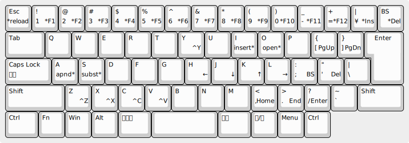

# wim-jus.ahk

Windows/Vim compromise key bindings for US like layout on JIS keyboard.

## TL;DR

- テキストモード (デフォルト) と カーソルモード がある
- `変換` でカーソルモード
- `無変換` (または `i` など) でテキストモード
- カーソルモードは `hjkl` カーソル
- テキストモードでは `変換` を修飾キーとしたカーソル移動ができる
- `変換-Esc` で wim-jus.ahk をリロード
- `RShift` でモード表示

## wim-jus

wim-jus は Vim にいくらか似た Windows 向けのキーバインドです。
[AutoHotkey](https://www.autohotkey.com/) で実装されています。
JIS キーボード上に US 配列を実現するとともに、 `hjkl` キーでカーソル移動などが行えるようになっています。

wim-jus は、**テキストモード** と **カーソルモード** をもちます。

デフォルト (初期モード) のテキストモードでは、(`変換`, `無変換`, `ひらがな` キーを除く) Windows 標準のキーバインドが有効です。

`変換` キーで、カーソルモードに移ります。
カーソルモードでは、`h`, `j`, `k`, `l` キーによるカーソル移動などが行えます。
`無変換` キーで、テキストモードに戻ります。

`無変換` キーは、他のキーと押すと `Ctrl-` としてはたらきます。

`半角/全角` キーは `Esc` キーに、
`ひらがな` キーは `半角/全角` キーになります。

## カーソルモード

### カーソル移動

- `h`, `j`, `k`, `l`: カーソル移動
- `,`, `.`: 行頭/行末
- `[`, `]`: 前/次ページスクロール

### Vim 風

- `a`, `i`: テキストモード
- `A`: 行末に移動してテキストモード
- `I`: 行頭に移動してテキストモード
- `o`: 現在行の下に新しい行を作成してテキストモード
- `O`: 現在行の上に新しい行を作成してテキストモード

### Windows 風

- `z`: アンドゥ (`C-z`)
- `x`: カット (`C-x`)
- `c`: コピー (`C-c`)
- `v`: 貼り付け (`C-v`)
- `y`: リドゥ (`C-y`)

### 編集

- `;`: バックスペース
- `'`: 削除

### その他

- `Enter`: 改行してテキストモード
- `s`: 1 文字選択してテキストモード
- `S`: 1 行選択

## テキストモードとカーソルモードで共通の操作

`変換` を押したまま他のキーを押すことで、 [カーソル移動](#カーソル移動) や [編集](#編集) の操作が行えます。

## ヒント

- カーソルモードで `無変換-,`, `無変換-.` で、ファイル先頭/末尾に移動
- `無変換-h`, `無変換-l` で単語単位の移動
- `H`, `J`, `K`, `L`, `<`, `>`, `{`, `}` で範囲選択。`無変換-H`, `無変換-L`, `無変換-<`, `無変換->`, `無変換-{`, `無変換-}` も使えます
- `無変換-;`, `無変換-'` で単語単位のバックスペース/削除
- `s` に続けて文字列を入力すると 1 文字を文字列で置き換える
- `SJJ` で 3 行選択し、続けて `i` でテキストモードに移り編集
- `A-変換-4` でウィンドウを閉じる

## 注意

- `W-→` のつもりで `W-変換-l` とすると `W-l` と解釈され、Windows がロックされてしまう

### 参考: `W-l` の Windows のロックの無効化

- regedit (レジストリエディタ)
- `HKEY_CURRENT_USER\Software\Microsoft\Windows\CurrentVersion\Policies\System`
- `DisableLockWorkstation`
- 値を 1 に設定

## 関連情報

### vim_ahk

- [GitHub - rcmdnk/vim_ahk: Setting file to emulate vim with AutoHotKey](https://github.com/rcmdnk/vim_ahk)
- [Vim以外でVimする: Windows+AutoHotkey編](https://rcmdnk.com/blog/2013/08/03/computer-windows-autohotkey/)

### SpaceFN

- [The SpaceFN layout: trying to end keyboard inflation](https://geekhack.org/index.php?topic=51069.0)
- [GitHub - lydell/spacefn-win: A Windows implementation of the SpaceFN keyboard layout.](https://github.com/lydell/spacefn-win)
- [TouchCursor - TouchCursor Manual](http://martin-stone.github.io/touchcursor/help.html)
